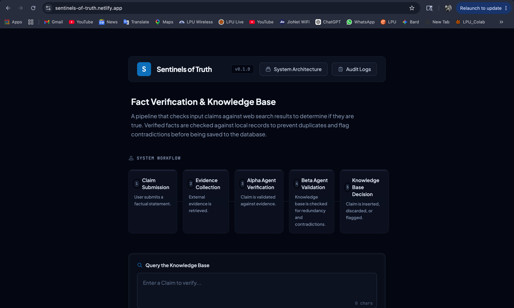
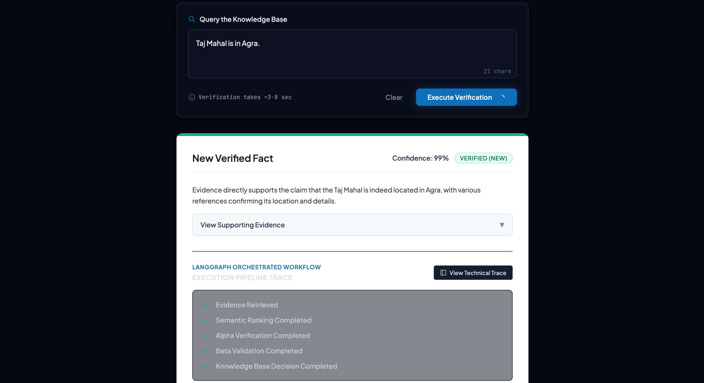
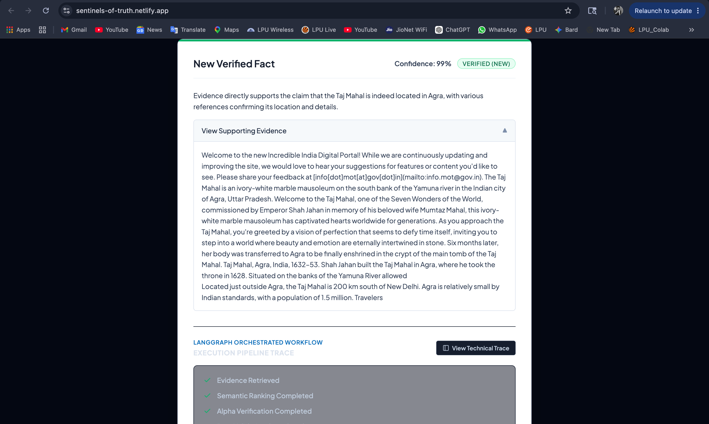
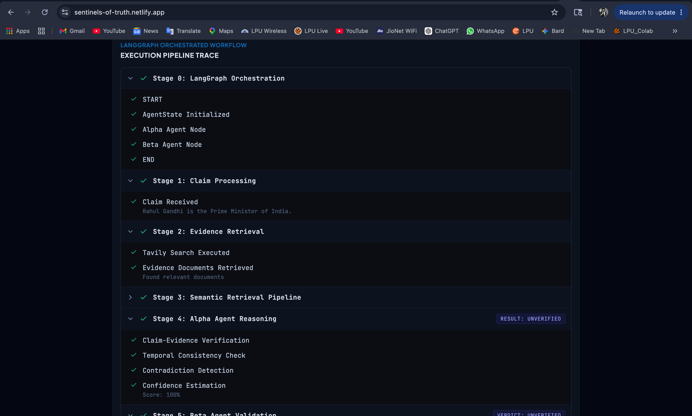
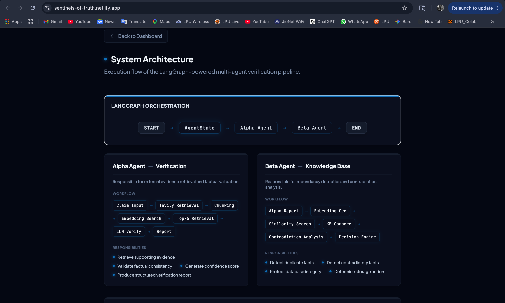
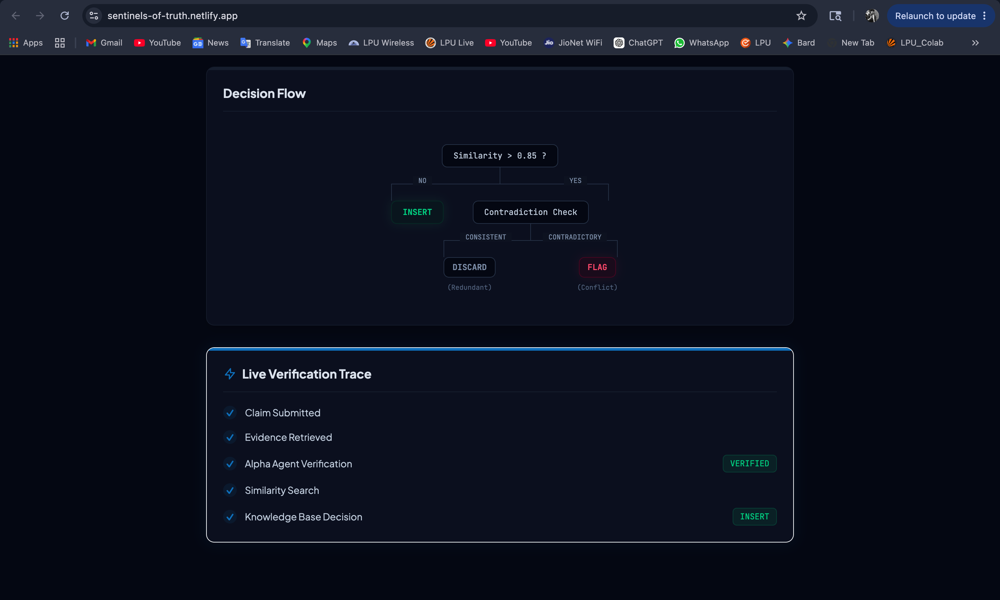
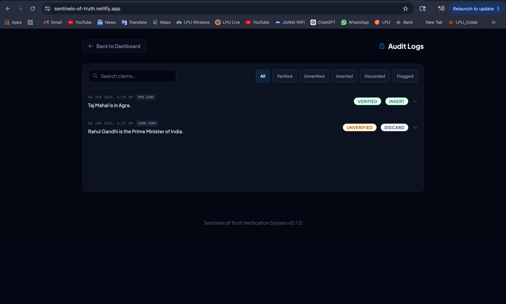
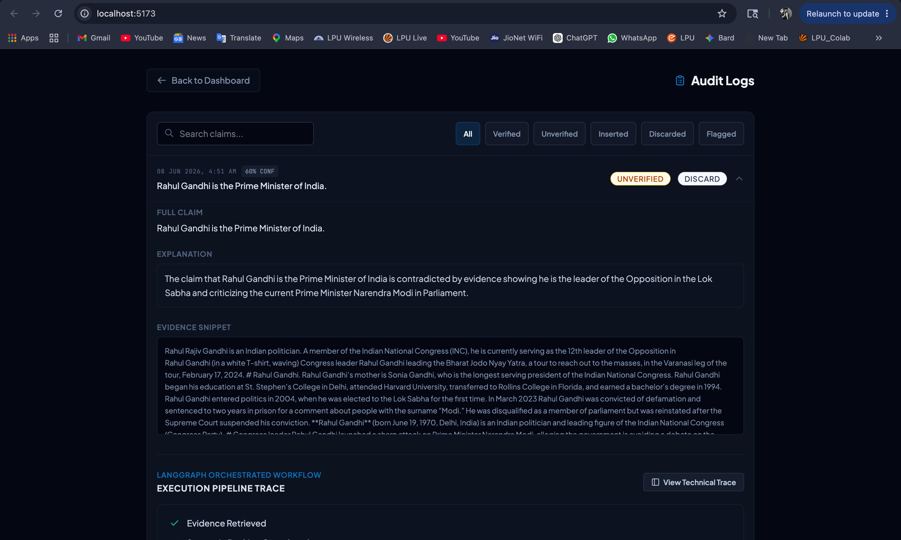
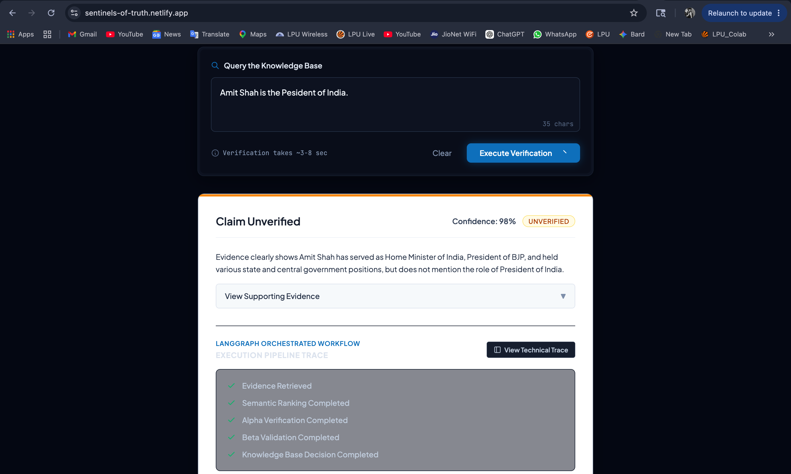

# Sentinels of Truth
### Multi-Agent Knowledge Verification & Fact Validation Platform


Sentinels of Truth is an AI-powered fact verification platform that combines external evidence retrieval, large language model reasoning, semantic similarity search, and knowledge base validation to determine the credibility of factual claims.

The system is orchestrated using **LangGraph**, where multiple agents collaborate through a shared **AgentState** to verify, validate, and manage facts before they are stored in the knowledge base.

> **⚠️ Deployment Note**
>
> The backend is hosted on **Render Free Tier**. After a period of inactivity, Render automatically puts the service into a sleep state. As a result, the **first request may take approximately 15–20 seconds** due to a cold start. Subsequent requests are processed normally without this delay.

# Live Deployment

### Frontend
https://sentinels-of-truth.netlify.app

### Backend API
https://sentinels-of-truth-api.onrender.com

### API Documentation
https://sentinels-of-truth-api.onrender.com/docs

---

## Problem Statement

The internet contains an overwhelming amount of information, making it difficult to distinguish verified facts from misinformation.

Traditional search systems retrieve information but do not perform structured verification or knowledge base consistency checks.

Sentinels of Truth addresses this challenge through a multi-agent verification workflow that:

- Retrieves supporting evidence from trusted web sources
- Performs AI-driven fact verification
- Detects duplicate facts
- Detects contradictory facts
- Maintains knowledge base integrity
- Provides a complete audit trail of all verification activities

---

# System Architecture

## LangGraph Orchestration Workflow

```text
START
  │
  ▼
AgentState
  │
  ▼
Alpha Agent
(Evidence Verification)
  │
  ▼
Beta Agent
(Knowledge Base Validation)
  │
  ▼
END
```

The workflow is implemented using LangGraph StateGraph orchestration.

Each stage receives and updates a shared AgentState object, enabling transparent state transitions across the verification pipeline.

---

## AgentState Schema

```python
from typing import TypedDict

class AgentState(TypedDict, total=False):
    claim: str
    report: dict
    verdict: str
    db_action: str
    history: list[str]
    conflicting_fact_id: int
    stored_claim: str
    similarity_score: float
    stored_status: str
```

The AgentState serves as the shared memory object exchanged between agents during workflow execution.

### Field Description

| Field | Purpose |
|---------|---------|
| claim | Incoming claim submitted for verification |
| report | Structured verification report generated by Alpha Agent |
| verdict | Final classification (NEW, REDUNDANT, UNVERIFIED, CONFLICT) |
| db_action | Database action decided by Beta Agent (INSERT, DISCARD, FLAG) |
| history | Execution history used for workflow tracing |
| conflicting_fact_id | ID of the related fact found in the knowledge base |
| stored_claim | Existing claim retrieved during similarity search |
| similarity_score | Cosine similarity score between incoming and stored claims |
| stored_status | Status of the matched claim stored in the knowledge base |
```

---

Verification Pipeline


User Claim
    │
    ▼
Tavily Search API
    │
    ▼
Evidence Retrieval
    │
    ▼
Evidence Chunking
    │
    ▼
Semantic Ranking
    │
    ▼
Top-K Evidence Selection
    │
    ▼
Alpha Agent
(Evidence Verification)
    │
    ▼
Verification Report
    │
    ▼
HuggingFace Embeddings
(all-MiniLM-L6-v2)
    │
    ▼
Beta Agent
(Knowledge Base Validation)
    │
    ▼
Similarity Search
    │
    ▼
Duplicate Detection
    │
    ▼
Contradiction Detection
    │
    ▼
Knowledge Base Decision
    │
    ├── INSERT
    ├── DISCARD
    └── FLAG
    │
    ▼
Audit Logging
    │
    ▼
Final Verdict
```

---

# Alpha Agent

## Responsibility

The Alpha Agent performs factual verification using external evidence.

### Workflow

```text
Claim Input
    │
    ▼
Tavily Retrieval
    │
    ▼
Evidence Chunking
    │
    ▼
Semantic Ranking
    │
    ▼
Top-K Evidence Retrieval
    │
    ▼
LLM Verification
    │
    ▼
Verification Report
```

### Outputs

- Verification Status
- Confidence Score
- Supporting Evidence
- Explanation
- Structured Verification Report

---

# Beta Agent

## Responsibility

The Beta Agent protects knowledge base integrity.

### Workflow

```text
Alpha Report
    │
    ▼
Embedding Generation
    │
    ▼
Similarity Search
    │
    ▼
Knowledge Base Comparison
    │
    ▼
Contradiction Analysis
    │
    ▼
Decision Engine
```

### Outputs

- INSERT
- DISCARD
- FLAG

### Responsibilities

- Detect duplicate facts
- Detect contradictory facts
- Prevent redundant storage
- Protect knowledge base consistency
- Determine final database action

---

# Knowledge Base Decision Logic

```text
Similarity > Threshold?
        │
   ┌────┴────┐
   │         │
  NO        YES
   │         │
 INSERT   Contradiction Check
             │
      ┌──────┴──────┐
      │             │
 Consistent   Contradictory
      │             │
 DISCARD       FLAG
```

---

# Audit Logging System

Every verification request is permanently recorded.

Stored Information:

- Claim
- Verification Status
- Confidence Score
- Explanation
- Evidence
- Database Action
- Final Verdict
- Similarity Score
- Related Fact References
- Timestamp

### Features

- Persistent Storage
- Refresh Safe
- Searchable
- Filterable
- Historical Verification Records

---

# Technical Traceability

The system exposes execution trace visibility through the frontend interface.

Example Trace:

```text
Stage 0: LangGraph Orchestration
    ├── START
    ├── AgentState Initialized
    ├── Alpha Agent Node
    ├── Beta Agent Node
    └── END

Stage 1: Claim Processing

Stage 2: Evidence Retrieval

Stage 3: Semantic Retrieval Pipeline

Stage 4: Alpha Agent Reasoning

Stage 5: Beta Agent Validation

Stage 6: Knowledge Base Decision
```

---

# Tech Stack

## Backend

- FastAPI
- LangGraph
- LangChain
- Groq LLM
- Tavily Search API
- SQLAlchemy
- SQLite
- Pydantic

# AI & NLP

- Groq LLM
- Tavily Search API
- HuggingFace Hub InferenceClient
- all-MiniLM-L6-v2 Embeddings
- Semantic Similarity Search
- Cosine Similarity
- Knowledge Base Validation

## Frontend

- React
- JavaScript
- CSS
- Vite

---

# Project Structure

```text
backend/
│
├── app/
│   ├── agents/
│   │   ├── alpha_agent.py
│   │   └── beta_agent.py
│   │
│   ├── routes/
│   │   ├── verification.py
│   │   └── audit.py
│   │
│   ├── services/
│   │   ├── tavily_service.py
│   │   ├── llm_service.py
│   │   └── embedding_service.py
│   │
│   ├── database/
│   │   ├── db.py
│   │   └── models.py
│   │
│   ├── state/
│   │   └── state.py
│   │
│   └── main.py
│
├── requirements.txt
│
frontend/
│
├── src/
│   ├── components/
│   ├── views/
│   ├── services/
│   └── App.jsx
```

---

# API Endpoints

## Verify Claim

```http
POST /api/v1/verify/
```

### Request

```json
{
  "claim": "Google CEO is Sundar Pichai."
}
```

### Response

```json
{
  "claim": "Google CEO is Sundar Pichai.",
  "status": "VERIFIED",
  "confidence": 95,
  "reason": "Evidence supports the claim.",
  "evidence": "...",
  "db_action": "INSERT",
  "verdict": "NEW"
}
```

---

## Audit Log Retrieval

Retrieve a specific verification record using:

```http
GET /api/v1/audit-logs/{id}
```

This endpoint enables traceability and explainability by returning the complete verification history associated with a specific audit log entry.

---

## Health Check

```http
GET /health
```

---

# Installation

## Clone Repository

```bash
git clone https://github.com/your-username/sentinels-of-truth.git
```

```bash
cd sentinels-of-truth
```

---

## Backend Setup

```bash
cd backend
```

```bash
python -m venv venv
```

```bash
source venv/bin/activate
```

Windows:

```bash
venv\Scripts\activate
```

Install dependencies:

```bash
pip install -r requirements.txt
```

Create .env

```env
GROQ_API_KEY=your_key
TAVILY_API_KEY=your_key
```

Run Backend:

```bash
uvicorn app.main:app --reload
```

---

## Frontend Setup

```bash
cd frontend
```

```bash
npm install
```

```bash
npm run dev
```

---

# Example Use Cases

### Verified Fact

```text
Google CEO is Sundar Pichai.
```

Result:

```text
VERIFIED
INSERT
```

---

### Duplicate Fact

```text
Water boils at 100°C at sea level.
```

Result:

```text
VERIFIED
DISCARD
```

---

### Contradictory Fact

```text
Rahul Gandhi is the Prime Minister of India.
```

Result:

```text
UNVERIFIED
DISCARD
```

---


# Deployment Architecture

```text
Frontend
(React + Vite)
      │
      ▼
Netlify
      │
      ▼
FastAPI Backend
(Render)
      │
      ▼
LangGraph Workflow
      │
 ┌────┴────┐
 │         │
 ▼         ▼
Alpha     Beta
Agent     Agent
 │         │
 └────┬────┘
      ▼
SQLite Database
      │
      ▼
Audit Logs

External Services:
- Tavily Search API
- Groq LLM
- HuggingFace Inference API
```
# Screenshots

## Home Dashboard

The main interface where users submit factual claims for verification.



---

## Verified Claim Result

Example of a successfully verified claim with confidence score and verdict.



---

## Supporting Evidence

Evidence retrieved from external trusted sources and used during verification.



---

## Technical Execution Trace

LangGraph execution pipeline showing the verification workflow stages.



---

## System Architecture – Overview

High-level architecture of the Sentinels of Truth platform.



---

## System Architecture – Detailed Flow

Detailed workflow illustrating agent orchestration and decision making.



---

## Audit Logging Dashboard

Audit records generated after verification requests.



---

## Audit Log Details

Detailed view of stored verification history and decision trace.



---

## Unverified Claim Result

Example of a claim identified as unsupported or false.



# Future Improvements

## Retrieval Quality

- Top-K Diverse Retrieval
- Maximum Marginal Relevance (MMR)
- Hybrid Search (Semantic + Keyword)
- Source Reliability Scoring
- Citation Ranking

## Scalability

- FAISS / Vector Database Integration
- Approximate Nearest Neighbor Search
- PostgreSQL + pgvector
- Distributed Embedding Storage

## Multi-Agent Enhancements

- Dynamic Agent Routing
- Additional Specialized Agents
- Multi-Step Reasoning Workflows
- Human-in-the-Loop Verification

## Performance & Concurrency

- Concurrent Verification Requests
- Async Agent Execution
- Queue-Based Processing
- Background Verification Workers
- Horizontal API Scaling

---

# Project Highlights

✅ Multi-Agent Verification Pipeline

✅ LangGraph StateGraph Orchestration

✅ Evidence-Based Fact Verification

✅ HuggingFace Semantic Embeddings

✅ Semantic Redundancy Detection

✅ Duplicate Fact Detection

✅ Contradiction Detection

✅ Knowledge Base Integrity Protection

✅ Persistent Audit Logging

✅ Explainable AI Decisions

✅ FastAPI REST Backend

✅ React Frontend

✅ Deployed on Render & Netlify
---
# Author

**Shubham Gupta**

B.Tech Computer Science Engineering

Lovely Professional University

GitHub:
https://github.com/shubhamgupta407

Project:
Sentinels of Truth – Multi-Agent Knowledge Verification & Fact Validation Platform

# Version

**Sentinels of Truth v0.1.0**

An AI-Powered Multi-Agent Fact Verification & Knowledge Base System built using LangGraph, FastAPI, Groq, Tavily Search, Semantic Retrieval, and Persistent Audit Logging.
